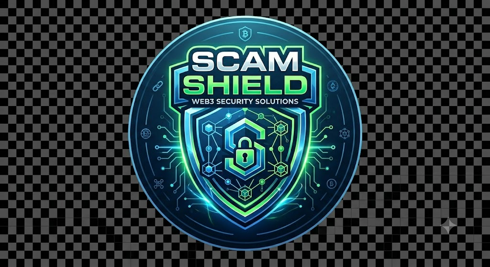

# 🛡️ ScamShield AI — Decentralized Token Threat Detection Console

ScamShield is a next-generation Web3 security scanner and threat intelligence console powered by **GenLayer Intelligent Contracts** and decentralized validator consensus. It detects honeypots, rug pulls, high-tax traps, and malicious code patterns in real time by aggregating validator consensus.

<p align="center">
  
</p>

## ✨ Features

- **Decentralized AI Consensus**: Bypasses centralized oracle vulnerabilities by running multi-agent consensus checks directly on GenLayer validators.
- **Real-Time Token Analysis**: Input any EVM or Solana token contract address to query automated risk profiling.
- **Contract Telemetry Grid**: Showcases key metrics such as Total Supply, Creator Address, Buy/Sell Tax, and Liquidity.
- **Visual Validator Breakdown**: Real-time progress tracking of validator rounds (e.g., Bear, Fox, Wolf, Cat, Shield nodes) and their votes.
- **Interactive Vulnerability Logs**: Deep details on flagged warning items with chronological logging.
- **Network Telemetry Dashboard**: Interactive live indicators displaying consensus health, node latency, and threat feeds.

---

## 🛠️ Tech Stack

- **Frontend**: React 18, TypeScript, Vite, Tailwind CSS, Framer Motion
- **Web3 Integration**: GenLayer JS SDK, MetaMask GenLayer Snap
- **Design System**: Premium retro-cyberpunk terminal aesthetics with custom HSL variables and motion layouts.

---

## 🚀 Quick Start

### 1. Installation
Install the project dependencies using `pnpm` (recommended):
```bash
pnpm install
```

### 2. Environment Setup
Create a `.env` file in the root directory:
```env
VITE_CONTRACT_ADDRESS="0x..." # Your GenLayer intelligent contract address
```

### 3. Run Dev Server
Start the Vite local development server:
```bash
pnpm dev
```

### 4. Build for Production
Verify production builds and output optimization:
```bash
pnpm build
```

---

## 🔒 Security & Architecture

ScamShield routes all scan requests to an Intelligent Contract deployed on GenLayer's network. The contract executes external API lookups across security providers (like GoPlus) on-chain using consensus. 

Validators process the bytecode, calculate the Byzantine consensus score, and return a tamper-proof scan verdict to the user interface.

---

## 👤 Developer
Built with 💚 by Yousuf — Indie Hacker & AI SaaS Builder.
*Standardized under Yousuf's Universal Project Guidelines (AGENTS.md v2.0)*
