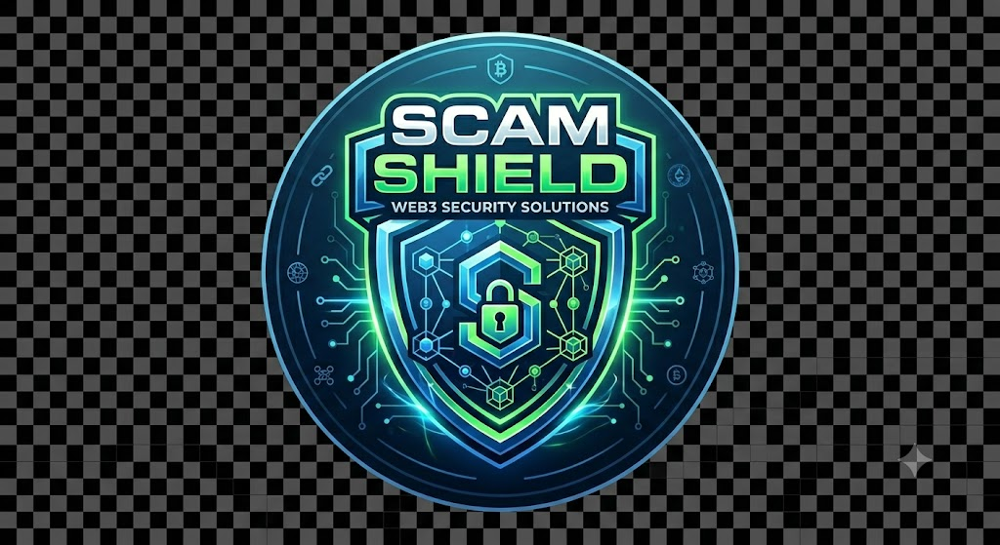

# 🛡️ ScamShield AI — Decentralized Token Threat Detection Console

ScamShield is a next-generation Web3 security scanner and threat intelligence console powered by **GenLayer Intelligent Contracts** and decentralized validator consensus. It detects honeypots, rug pulls, high-tax traps, and malicious smart contract patterns in real time by aggregating validator consensus over chain-matched security provider evidence.

<p align="center">
  
</p>

## ✨ Key Features & Architecture

- **Authoritative Provider Evidence Chain-Matching**: Evaluates security metrics via GenLayer Intelligent Contracts. Parses structured JSON evidence (DexScreener, GoPlus Token, GoPlus NFT, Birdeye) and strictly enforces chain-matching, rejecting any out-of-chain pairs or token substitutions.
- **Material Verdict Field Equivalence Principle**: Validator consensus enforces strict equivalence over material security fields:
  1. *Identity & Chain Binding*: Both validator outputs must bind to the requested chain and identify the exact same token/project (or both agree it is UNKNOWN).
  2. *Verdict Equivalence*: Final verdict must match (`SAFE`, `RISKY`, `SCAM`, `UNKNOWN`).
  3. *Risk Score Bracket*: Scores must be within ±5 points and belong to the same risk category.
  4. *Evidence Sufficiency*: Agreement on whether authoritative evidence was available (`SUFFICIENT` vs `INSUFFICIENT`).
  5. *Core Security Drivers*: Agreement on key risk flags and vulnerabilities.
- **Genuine GenLayer Consensus Telemetry**: The UI displays only telemetry directly returned by GenLayer:
  - Real validator committee addresses (`round_validators`)
  - Real on-chain consensus votes (`votes_revealed`, `votes_committed`, `validator_votes_name`)
  - Consensus execution results (`MAJORITY_AGREE`, `num_of_rounds`)
  - Zero synthetic node mascots, zero fake confidence percentages, and zero fabricated metrics.
- **Multi-Chain Coverage**: Full support for Ethereum, BSC, Polygon, Arbitrum, Base, and Solana.

---

## 📜 Deployed Intelligent Contract

- **Network**: GenLayer Studio Network (Chain ID: `61999` / `0xf22f`)
- **RPC URL**: `https://studio.genlayer.com/api`
- **Contract Address**: `0x5802c5AE337b7c79723beC9d0017C32DCAec12b7`
- **Contract Methods**:
  - `@gl.public.write def scan_token(self, token_address: str, chain_id: str) -> None`
  - `@gl.public.view def get_scan_result(self, token_address: str) -> str`

---

## 🛠️ Tech Stack

- **Intelligent Contract**: Python (`py-genlayer`), `gl.eq_principle.prompt_non_comparative`
- **Frontend**: React 18, TypeScript, Vite, Tailwind CSS, Framer Motion
- **Web3 Integration**: `genlayer-js` SDK, standard browser wallet provider (`window.ethereum`)
- **Design System**: Retro-cyberpunk terminal aesthetics with custom HSL variables and motion layouts.

---

## 🚀 Quick Start

### 1. Installation
Install the project dependencies:
```bash
npm install
```

### 2. Environment Setup
Create a `.env` file in the root directory:
```env
VITE_CONTRACT_ADDRESS="0x5802c5AE337b7c79723beC9d0017C32DCAec12b7"
VITE_GENLAYER_RPC="https://studio.genlayer.com/api"
```

### 3. Run Dev Server
```bash
npm run dev
```

### 4. Run Test Suite
```bash
npm test
```

### 5. Build for Production
```bash
npm run build
```

---

## 🔒 Verification & Steward Test Case

- **Target Network**: Ethereum
- **Contract Address**: `0x5510cd555b0ae386b420421a7ad98c6785499983` (Rally NFT)
- **Live Transaction Proof**: `0x411a919eb85ecc6303d74c3f17272fdf78db2fda552048bf249cca9f58e3b1cd`
- **Consensus Result**: `MAJORITY_AGREE` by 5 GenLayer validators
- **Persisted Verdict**: `UNKNOWN` / `INSUFFICIENT DATA` (never Solayer / LAYER)

---

## 👤 Developer
Built with 💚 by Yousuf — Indie Hacker & AI SaaS Builder.
*Standardized under Yousuf's Universal Project Guidelines (AGENTS.md v2.0)*
